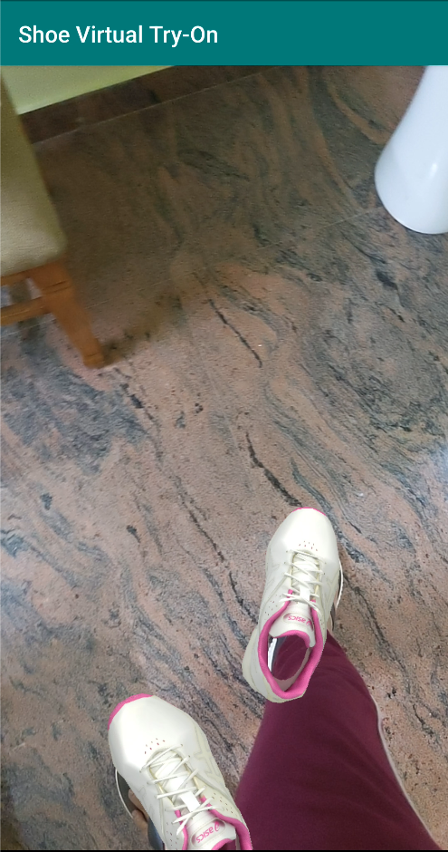
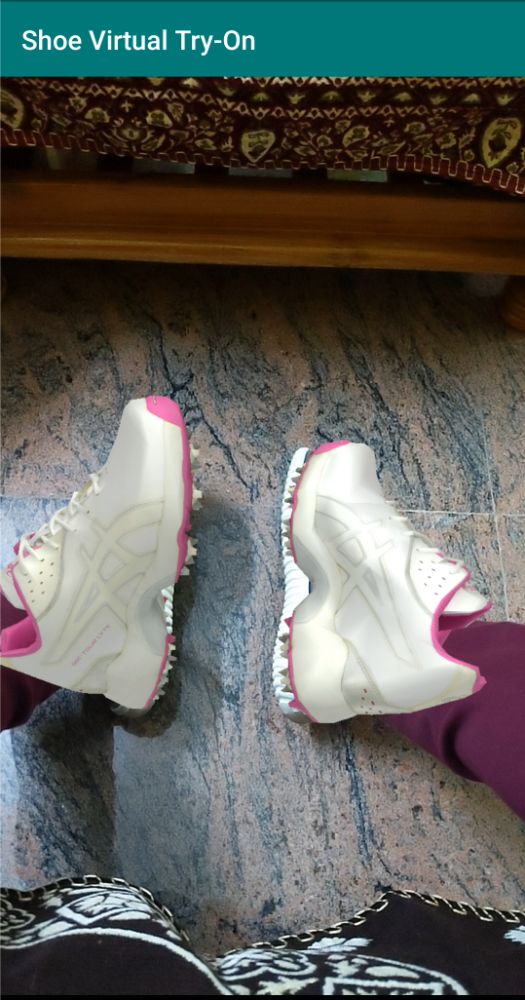
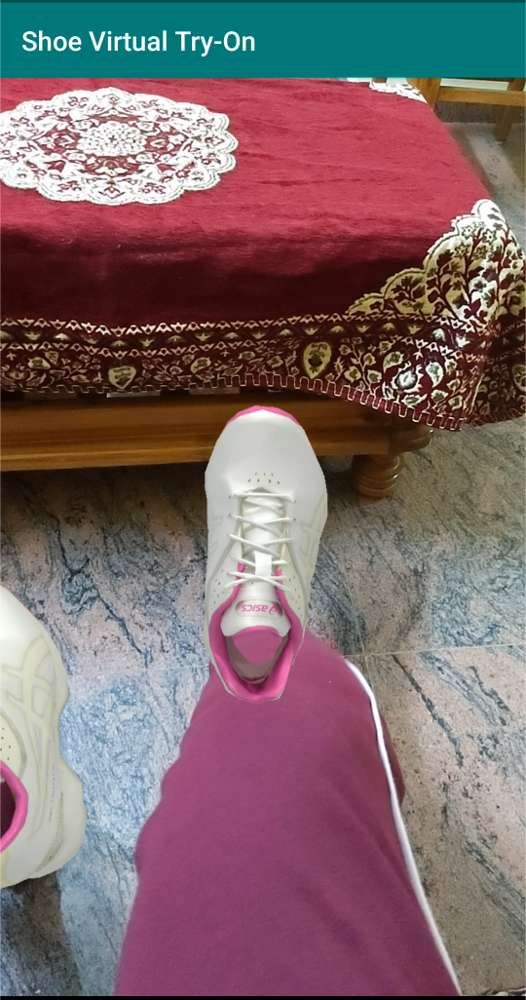

[](https://img.shields.io/badge/Status-Inprogress-red)

<!-- PROJECT LOGO -->

<br />
<p align="center">
  <a href="https://github.com/Princep/congenial-system">
    
  </a>

  <h3 align="center">Virtual TryOn</h3>

  <p align="center">
    AR application for virtual try on of sneakers
    <br />
    <a href="https://github.com/PrinceP/congenial-system/demo1.mp4">View Demo</a>
    ·
    <a href="https://github.com/PrinceP/congenial-system/issues">Report Bug</a>
    ·
    <a href="https://github.com/PrinceP/congenial-system/issues">Request Feature</a>
  </p>
</p>

<!-- TABLE OF CONTENTS -->

<details open="open">
  <summary><h2 style="display: inline-block">Table of Contents</h2></summary>
  <ol>
    <li>
      <a href="#about-the-project">About The Project</a>
      <ul>
        <li><a href="#built-with">Built With</a></li>
        <li><a href="#template-development">Template development</a></li>
        <li><a href="#deployment">Deployment</a></li>
      </ul>
    </li>
    <li>
      <a href="#getting-started">Getting Started</a>
      <ul>
        <li><a href="#prerequisites">Prerequisites</a></li>
        <li><a href="#installation">Installation</a></li>
      </ul>
    </li>
    <li><a href="#usage">Usage</a></li>
    <li><a href="#roadmap">Roadmap</a></li>
    <li><a href="#contributing">Contributing</a></li>
    <li><a href="#license">License</a></li>
    <li><a href="#contact">Contact</a></li>
    <li><a href="#acknowledgements">Acknowledgements</a></li>
  </ol>
</details>

<!-- ABOUT THE PROJECT -->

## About The Project

The state of the art in machine learning (ML) has achieved exceptional accuracy on many computer vision tasks solely by training models on photos. Building upon these successes and advancing 3D object understanding has great potential to power a wider range of applications, such as augmented reality, robotics, autonomy, and image retrieval.

[Source](https://ai.googleblog.com/2020/11/announcing-objectron-dataset.html)

Here we are presenting to develop an AR application which overlays a 3D object on the existing shoes.

### Solution



### **TEMPLATE DEVELOPMENT**

#### **Some 3D models can be used from here**

[https://app.gazebosim.org/dashboard](https://app.gazebosim.org/dashboard)

Once downloaded, they can be transform as shown below.

[Source](https://github.com/google/mediapipe/blob/master/docs/solutions/objectron.md)

> First run
>
> ```shell
> ./mediapipe/graphs/object_detection_3d/obj_parser/obj_cleanup.sh [INPUT_DIR] [INTERMEDIATE_OUTPUT_DIR]
> ```
> and then run
>
> ```bash
> bazel run -c opt mediapipe/graphs/object_detection_3d/obj_parser:ObjParser -- input_dir=[INTERMEDIATE_OUTPUT_DIR] output_dir=[OUTPUT_DIR]
> ```
> INPUT_DIR should be the folder with initial asset .obj files to be processed,
> and OUTPUT_DIR is the folder where the processed asset .uuu file will be placed.
>
> Note: ObjParser combines all .obj files found in the given directory into a
> single .uuu animation file, using the order given by sorting the filenames alphanumerically. Also the ObjParser directory inputs must be given as
> absolute paths, not relative paths. See parser utility library at [`mediapipe/graphs/object_detection_3d/obj_parser/`](https://github.com/google/mediapipe/tree/master/mediapipe/graphs/object_detection_3d/obj_parser/) for more details.


### **DEPLOYMENT**


|  |  |
|--------|-----------|

---------------------------

  |  |
:------------------------------: | :------------------------------: |

### Built With

*   mediapipe
*   Android

<!-- GETTING STARTED -->

## Getting Started

To get a local copy up and running follow these simple steps.

### Prerequisites

*   mediapipe

### Installation

1.  Clone the repo
    ```sh
    git clone https://github.com/Princep/congenial-system.git
    git submodules update
    cd mediapipe
    ```

2.  Use mediapipe

* Replace the textures and models
```bash
#Update the model_scale and model_transformation
model_scale: [0.45, 0.55, 0.15]
model_transformation: [1.0, 0.0, 0.0, 0.0]
model_transformation: [1.0, 0.0, 1.0, -0.9]
model_transformation: [0.0, 0.0, 0.0, 1.0]

#Animation file
cp mediapipe/examples/android/src/java/com/google/mediapipe/apps/objectdetection3d/assets/sneaker/model.obj.uuu mediapipe/examples/android/src/java/com/google/mediapipe/apps/objectdetection3d/assets/box.obj.uuu

#Texture file
cp mediapipe/examples/android/src/java/com/google/mediapipe/apps/objectdetection3d/assets/sneaker/texture.jpg mediapipe/examples/android/src/java/com/google/mediapipe/apps/objectdetection3d/assets/texture.jpg
```
* Prerequistes

```bash
cd mediapipe
#Add Android workspace in WORKSPACE file
android_sdk_repository(name = "androidsdk", build_tools_version = "30.0.2")
android_ndk_repository(name = "androidndk", api_level =	20)


# Switch to OpenCV 4
sed -i -e 's:3.4.3/opencv-3.4.3:4.0.1/opencv-4.0.1:g' WORKSPACE
sed -i -e 's:libopencv_java3:libopencv_java4:g' third_party/opencv_android.BUILD
```

* Build and install app
```bash
    bazel build -c opt --config android_arm64 mediapipe/examples/android/src/java/com/google/mediapipe/apps/objectdetection3d:objectdetection3d

    adb install -r bazel-bin/mediapipe/examples/android/src/java/com/google/mediapipe/apps/objectdetection3d/objectdetection3d.apk
```
 

*   Run the app

<!-- USAGE EXAMPLES -->

## Usage

*   Download the apk provided in Source code Archive.zip. Allow Permissions to install the apk. [Source](https://he-s3.s3.amazonaws.com/media/sprint/live-love-be/team/1504377/f78de20archive.zip)
*   Point it directly on your feets. NOTE : Make sure the feets have some existing shoes or sandals.

<!-- ROADMAP -->

## Roadmap

See the [open issues](https://github.com/Princep/congenial-system/issues) for a list of proposed features (and known issues).

<!-- CONTRIBUTING -->

## Contributing

Contributions are what make the open source community such an amazing place to learn, inspire, and create. Any contributions you make are **greatly appreciated**.

1.  Fork the Project
2.  Create your Feature Branch (`git checkout -b feature/AmazingFeature`)
3.  Commit your Changes (`git commit -m 'Add some AmazingFeature'`)
4.  Push to the Branch (`git push origin feature/AmazingFeature`)
5.  Open a Pull Request

<!-- LICENSE -->

## License

Distributed under the MIT License. See `LICENSE` for more information.

<!-- CONTACT -->

## Contact

Your Name - [@pp_spector](https://twitter.com/pp_spector) - prince.patel.14@gmail.com

Project Link: <https://github.com/PrinceP/congenial-system.git>

<!-- ACKNOWLEDGEMENTS -->

## Acknowledgements

*   [mediapipe](https://github.com/google/mediapipe)

<!-- MARKDOWN LINKS & IMAGES -->

<!-- https://www.markdownguide.org/basic-syntax/#reference-style-links -->

[contributors-shield]: https://img.shields.io/github/contributors/Princep/repo.svg?style=for-the-badge

[contributors-url]: https://github.com/Princep/congenial-system/graphs/contributors

[forks-shield]: https://img.shields.io/github/forks/Princep/repo.svg?style=for-the-badge

[forks-url]: https://github.com/Princep/congenial-system/network/members

[stars-shield]: https://img.shields.io/github/stars/Princep/repo.svg?style=for-the-badge

[stars-url]: https://github.com/Princep/congenial-system/stargazers

[issues-shield]: https://img.shields.io/github/issues/Princep/repo.svg?style=for-the-badge

[issues-url]: https://github.com/Princep/congenial-system/issues

[license-shield]: https://img.shields.io/github/license/Princep/repo.svg?style=for-the-badge

[license-url]: https://github.com/PrinceP/congenial-system/blob/main/LICENSE

[linkedin-shield]: https://img.shields.io/badge/-LinkedIn-black.svg?style=for-the-badge&logo=linkedin&colorB=555

[linkedin-url]: https://linkedin.com/in/princecv
